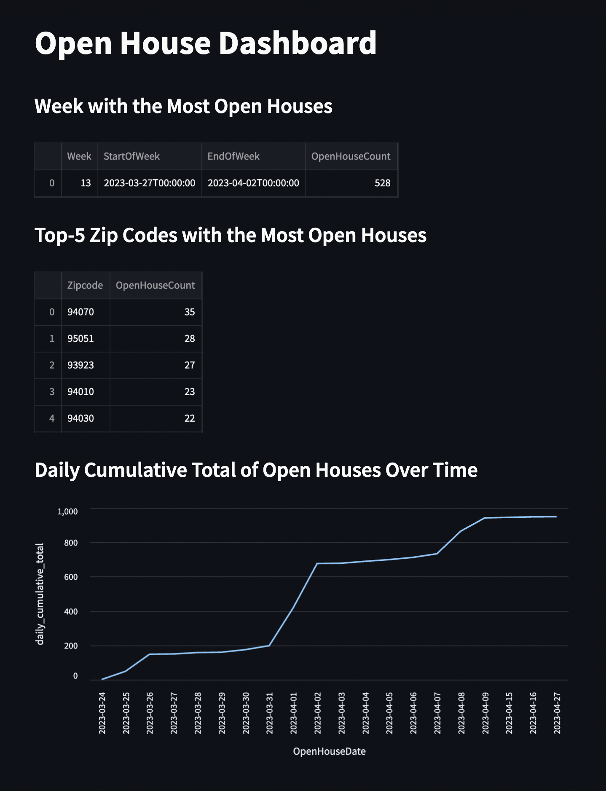
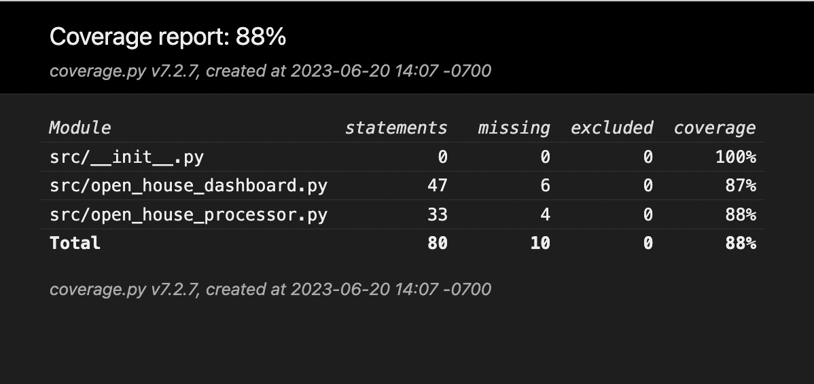

# Ace Haidrey - Data Engineer Technical Challenge - Responses

# High Level Overview

The design of this project is simple in the sense of what each script is accomplishing.
* [Processor](src/open_house_processor.py): Read input json, transform/clean it to our requirements, and write it out.
* [Dashboard](src/open_house_dashboard.py): Read the processed file above generated, query to return required information, and display.

## [Processor](src/open_house_processor.py)

* read: We simply read the json file, and if the path doesn't exist it will throw. That is part of design to fail fast.
* process: We convert the json dict to a dataframe for optimization.
  * From the requirements we convert `OpenHouseStartTime` and `OpenHouseEndTime` to utc datetimes. If it cannot be cast to it, it'll set it as null.
  * Then we strip out any null values from above and `OpenHouseKey` null keys
  * Lastly we sort by the `DateModified` descendingly to take the latest of each `OpenHouseKey`
  * We do all of it while keeping the object as a dataframe for optimized computation and storage
* write: We leverage the `to_parquet` method dataframe class has. If output path does not exist it will create it
* run: Self explanatory but wrapper around invoking the read, process, write paradigm

### Additional Notes
* read: If we see latency here, we will need to consider to use MR techniques to break up the file and process in chunks.
* process: If above is done, we will need to consider to use MR techniques to break up the file and process in chunks.
* write: Same as above as well and then join each temp file generated into a larger file.


## [Dashboard](src/open_house_dashboard.py)

We have three specific resultants we need to return, and so we break those up into specific
functions to return the query providing the required resultant.

### `get_week_most_open_houses_query`
```css
        SELECT
          DATE_PART('week', CAST(OpenHouseDate AS DATE)) AS Week,
          MIN(DATE_TRUNC('week', CAST(OpenHouseDate AS DATE))) AS StartOfWeek,
          MIN(DATE_TRUNC('week', CAST(OpenHouseDate AS DATE)) + INTERVAL '6 days') AS EndOfWeek,
          COUNT(*) AS OpenHouseCount
        FROM
          openhouses
        GROUP BY
          Week
        ORDER BY
          OpenHouseCount DESC
        LIMIT 1
```
This query uses the ISO8601 standard to identify what the week value is. We get the start/end dates of week based on that
leveraging the date_trunc function that will handle edge cases.
This query gets the week value for each record based on the `OpenHouseDate`, then group by this week number to get the count
for the number of houses for each week. It then sorts by the count value descending and selects the top 1.

### `get_top_zip_codes_query`
```css
        SELECT
          SUBSTRING(Zipcode, 1, 5) AS Zipcode, COUNT(*) AS OpenHouseCount
        FROM
          openhouses
        GROUP BY
          1
        ORDER BY
          OpenHouseCount DESC
        LIMIT 5
```
This query groups by the short `Zipcode` and counts how many records are attributed to each zip code.
It then sorts by the count value descending and selects the top 5.
Note, the query only considers the short zipcode (5 digits) so it treat 94521-3711 as 94521 to group by.

### `get_daily_cumulative_total_query`
```css
        SELECT
          OpenHouseDate,
          SUM(CountPerDay) OVER (ORDER BY OpenHouseDate) AS daily_cumulative_total
        FROM (
          SELECT
            OpenHouseDate,
            COUNT(*) AS CountPerDay
          FROM
            openhouses
          GROUP BY
            OpenHouseDate
        )
```
This query gets the count for each `OpenHouseDate` and then leverages a windowing function to count
the counts of the days from all the rows prior up to this row. This is why we order by `OpenHouseDate` and
because we do not pass in the dates to check it is default all records up to this record. We then pass it to
the `sum` aggregator.

## Unit Tests

All the tests are stored in the [tests](tests/) directory. We created a test per file.
### `test_open_house_processor.py`
* `test_process_data_multiple_records_openhousekey`: test multiple rows with the same `OpenHouseKey` to ensure we get the latest and merge the old records
* `test_process_data_invalid_timestamp`: test invalid start and end times get stripped out those records
* `test_process_data_null_openhousekey`: test null `OpenHouseKey` strips out
* `test_read_data`: mock the read function and ensure we return data
* `test_write_data`: mock the to_parquet function and ensure we invoke it with correct args
* `test_run`: mock read, process, and write to ensure all are invoked when run is

The above tests should give us good coverage of the processor which handles the important functionality.
We write this file in a unit test manner to showcase this way of writing tests. Truthfully it is what I am most comfortable with :)

### `test_open_house_dashboard.py`
* `test_most_open_houses_week`: Mock the sql query execution and ensure the underlying methods are invoked with resultant df
* `test_top_5_zip_codes`: Mock the sql query execution and ensure the underlying methods are invoked with resultant df
* `test_daily_cumulative_total`: Mock the sql query execution and ensure the underlying methods are invoked with resultant df
* `test_daily_cumulative_total`: Mock the `streamlit` functions are invoked and that the queries we wrote are passed to the execution engine

The above tests are written using pytest. Truthfully, have not used pytests much but have heard great things and this is my first go at it :)


## Results

### Dashboard Screenshot


### Dashboard Unit Tests
```css
============================= test session starts ==============================
collecting ... collected 4 items

test_open_house_dashboard.py::test_most_open_houses_week PASSED          [ 25%]
test_open_house_dashboard.py::test_top_5_zip_codes PASSED                [ 50%]
test_open_house_dashboard.py::test_daily_cumulative_total PASSED         [ 75%]
test_open_house_dashboard.py::test_display_dashboard PASSED              [100%]

========================= 4 passed, 1 warning in 1.16s =========================
```

### Processor Unit Tests
```css
============================= test session starts ==============================
collecting ... collected 6 items

test_open_house_processor.py::TestOpenHouseProcessor::test_process_data_invalid_timestamp PASSED [ 16%]
test_open_house_processor.py::TestOpenHouseProcessor::test_process_data_multiple_records_openhousekey PASSED [ 33%]
test_open_house_processor.py::TestOpenHouseProcessor::test_process_data_null_openhousekey PASSED [ 50%]
test_open_house_processor.py::TestOpenHouseProcessor::test_read_data PASSED [ 66%]
test_open_house_processor.py::TestOpenHouseProcessor::test_run PASSED    [ 83%]
Input file `/Users/ahaidrey/Documents/take-home-challenge/tests/test/openhouses.json` produced 2 raw records.
Processing produced 2 cleaned records.
Output file written in parquet to `/Users/ahaidrey/Documents/take-home-challenge/tests/test/test_processed_openhouses.parquet`.

test_open_house_processor.py::TestOpenHouseProcessor::test_write_data PASSED [100%]Created file `/Users/ahaidrey/Documents/take-home-challenge/tests/test/test_processed_openhouses.parquet` with the cleaned results.


============================== 6 passed in 0.74s ===============================
```

### Code Coverage


Run the command:
```PYTHONPATH=.:$PYTHONPATH pytest --cov=src/ --cov-report=html --junitxml=junit.xml ./tests```
```css
==== 10 passed, 1 warning in 1.61s ===
```
Try to generally have over 80% code coverage.

### Requirements & Git Ignore

* A dependency of streamlit is altair which fails when `altair>5.0.0` and `python>3.8`. Hard versioned it.
* Added testing modules for coverage
* Added gitignore here to not include unnecessary files.
